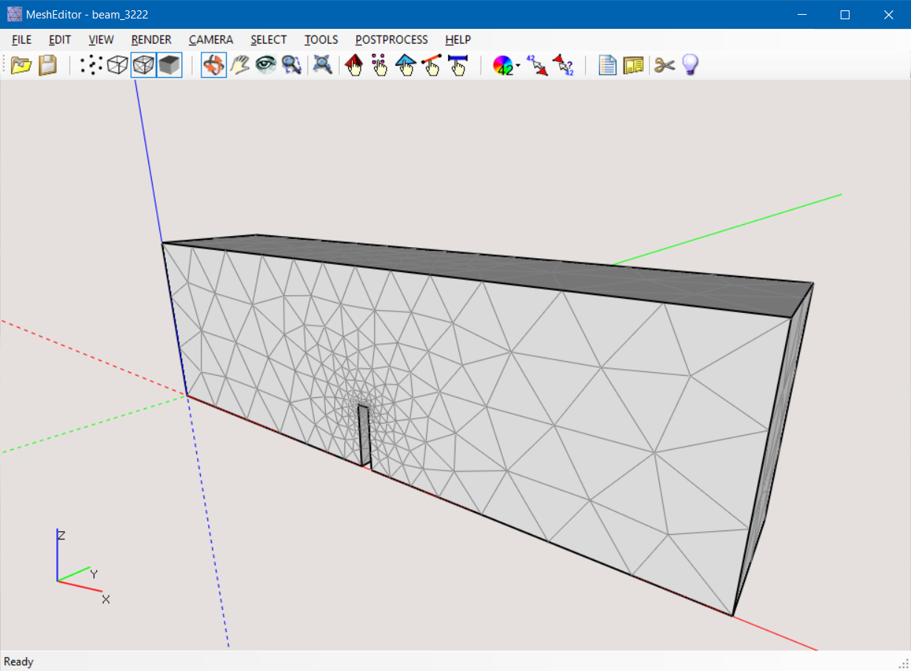

# MeshEditor v2.3.0

## User interface

### Main menu
### Key commands
### Camera manipulation
### Editor window split

## Mesh pre-processing
### Mesh entity selection
### Property assignment

## FEM results post-processing

## Supported file formats

## Installation requirements
